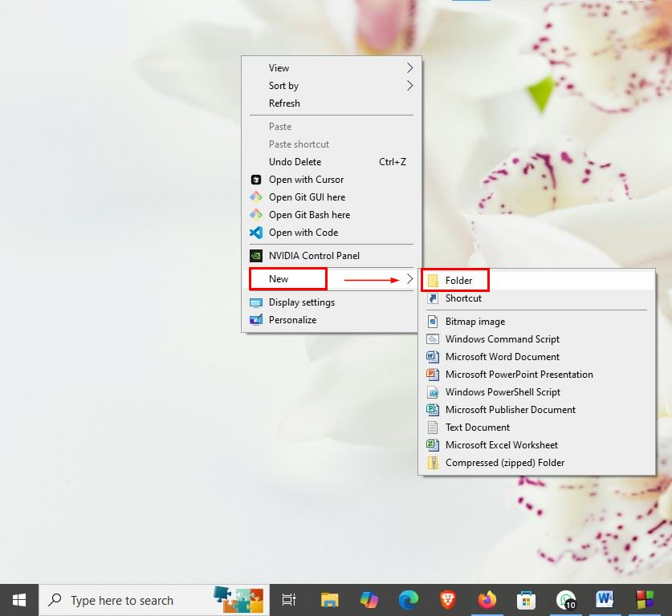
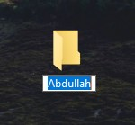
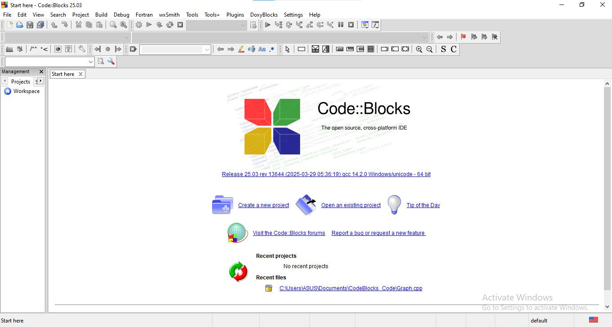
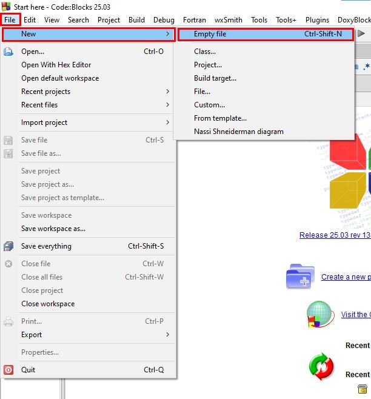
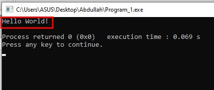
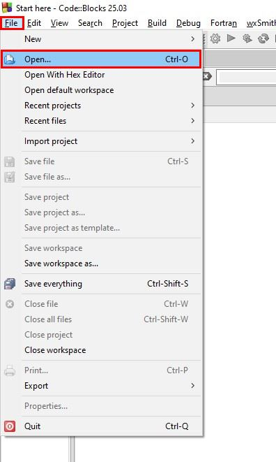
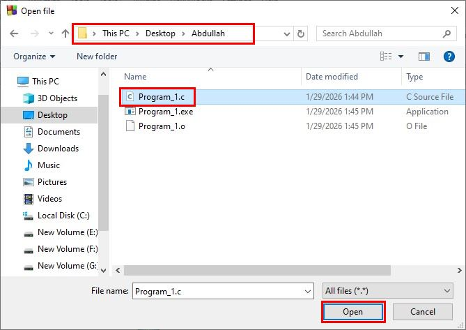
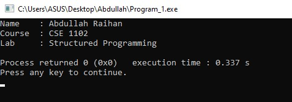
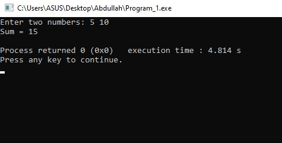

# CSE 1102: Structured Programming Sessional, Lab 01 Week 01

## Lab Title — Introduction to C programming and Code::Blocks

## Objective of This Lab

In this lab, students will learn how to:

- Create a working folder for programming practice
- Get familiar with the Code::Blocks IDE
- Create and save a C source file
- Write and run their **first C program**
- Understand the basic structure of a C program

### Course Outcome (CO) and Program Outcome (PO) Mapping

This experiment addresses the following course outcome and its associated program outcome:

- **Course Outcome (CO1):** _Apply basic C syntax to write, compile, and trace simple programs using development tools._
- **Mapped Program Outcome (PO1):** _Apply knowledge of mathematics, natural science, computing, and engineering fundamentals to solve basic engineering problems._

> **Note for students:**
> This lab assumes **no prior experience** with computers or programming.
> Please follow **each step carefully** and do not skip any instruction.

## Software Required

- **Code::Blocks IDE** (with MinGW compiler installed). Installation guide will be found [here](01_install_CodeBlocks.pdf). Please follow the process but download Code::Blocks 25.03 version instead of 20.03.

## Step 1: Creating a Working Folder on the Desktop

1. Go to your **Desktop screen**.
2. Move your mouse pointer to an **empty area** on the Desktop.
3. **Right-click** using the mouse.
4. From the menu, select **New → Folder**.
5. A new folder will appear with the name **New Folder**.
6. Rename the folder using **your name** (or any name given by your instructor).

> **Example:**
> The folder name used here is `Abdullah`.
> You should use **your own name** or any name you prefer.





## Step 2: Opening Code::Blocks

1. Look for the **Code::Blocks icon** on your computer screen.
   

2. **Double-click** the icon using the **left mouse button**.
3. If you don't find the Code::Blocks icon on your desktop screen, press **Windows** button on keyboard, type **codeblocks** and press **Enter** button.
4. Code::Blocks will start, and a window like the one shown below will appear.



> ⚠️ If Code::Blocks does not open, inform your lab instructor immediately.

## Step 3: Creating a New Empty File

1. From the menu bar, click **File → New → Empty File**
   **OR**
2. Press the keyboard shortcut:
   **Ctrl + Shift + N**
3. A new file will be created with a temporary name like `untitled1`.



## Step 4: Saving the File Correctly

1. Click **File → Save As**
   **OR** press **Ctrl + S**.


2. In the Save dialog:

   - Select **Desktop**
   - Double-click the folder you created in **Step 1**


3. Type a file name such as:

   ```
   Program_1.c
   ```

   

4. Click **Save**.

> ⚠️ **Important:**
>
> - The file name **must end with `.c`**
> - Otherwise, the program will not compile correctly.

## Step 5: Writing Your First C Program

1. Type the following code **exactly as shown** in the editor:

```c
#include <stdio.h>

int main() {
    printf("Hello World!\n");
    return 0;
}
```

2. Press **Ctrl + S** to save the file.

## Step 6: Building and Running the Program

You can run the program in **two ways**:

### Method 1: Using Buttons

- Click the **Build and Run** button
  (⚙️ gear icon + ▶ play icon)

### Method 2: Using Separate Buttons

- Click **Build** (⚙️ gear icon)
- Then click **Run** (▶ play icon)


## Expected Output

If everything is done correctly, a **console window** will appear showing:

```
Hello World!
```



## Common Mistakes to Avoid

- Forgetting to save the file before running
- Not using `.c` extension in file name
- Typing mistakes in the code
- Closing Code::Blocks accidentally

**If You Accidentally Close Code::Blocks**
Do **not panic**
Closing Code::Blocks does **not delete your program**. Your file is saved inside the folder you created.

## Reopening a Saved C File in Code::Blocks

### Method 1: Using Keyboard Shortcut **OR** Menu Navigation

1. Open **Code::Blocks**.
2. Do **either one** of the following:

   - Press **Ctrl + O**
     **OR**
   - Click **File → Open**

3. A file open dialog will appear.
   

4. Navigate to:

   - **Desktop**
   - Double-click your folder
   - Select your `.c` file (e.g., `Program_1.c`)

5. Click **Open**.
   

### Method 2: Opening Directly from the Folder (Very Easy)

1. Go to your **Desktop**.
2. Open your created folder.
3. Double-click the `.c` file.
4. The file will automatically open in **Code::Blocks**.
5. If the file doesn't automatically open with Code::Blocks, right click on the **file → open with** and then select Code::Blocks.

> ⚠️ **Important Reminder:**
>
> - Always open files with the **`.c` extension**
> - Always **save (Ctrl + S)** before running

## Lab Problems

### Example 1: Printing Output Using `printf()`

Write a complete C program that prints the following message on the screen:

```
Hello World!
```

#### Example Code

```c
#include <stdio.h>

int main() {
    printf("Hello World!\n");
    return 0;
}
```

#### Sample Output


### Practice Problems (Based on Example 1)

#### Problem 1

Write a C program that prints:

```
Welcome to BAUST.
```

Save the program as `Problem_1.c`.

#### Problem 2

Write a C program that prints your **full name** on the screen.

Save the program as `Problem_2.c`.

### Example 2: Printing Multiple Lines

Write a C program that prints the following output:

```
Name    : Abdullah Raihan
Course  : CSE 1102
Lab     : Structured Programming
```

#### Example Code

```c
#include <stdio.h>

int main() {
    printf("Name    : Abdullah Raihan\n");
    printf("Course  : CSE 1102\n");
    printf("Lab     : Structured Programming\n");
    return 0;
}
```

#### Sample Output



### Practice Problems (Based on Example 2)

#### Problem 3

Write a C program that prints:

```
Name    : Your Name
ID      : Your ID
Section : Your Section
```

Save the program as `Problem_3.c`.

### Example 3: Taking Input Using `scanf()` and Performing Addition

Write a C program that takes **two integer numbers** from the user and prints their **sum**.

#### Example Code

```c
#include <stdio.h>

int main() {
    int a, b, sum;

    printf("Enter two numbers: ");
    scanf("%d %d", &a, &b);

    sum = a + b;

    printf("Sum = %d\n", sum);
    return 0;
}
```

#### Sample Output



### Practice Problems (Based on Example 3)

#### Problem 5

Write a C program that takes two integers and prints their **subtraction result**.

Save the program as `Problem_5.c`.

#### Problem 6

Write a C program that takes two integers and prints their **multiplication result**.

Save the program as `Problem_6.c`.
