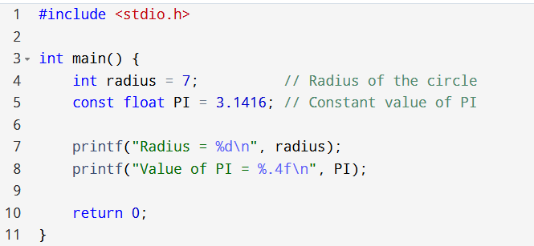
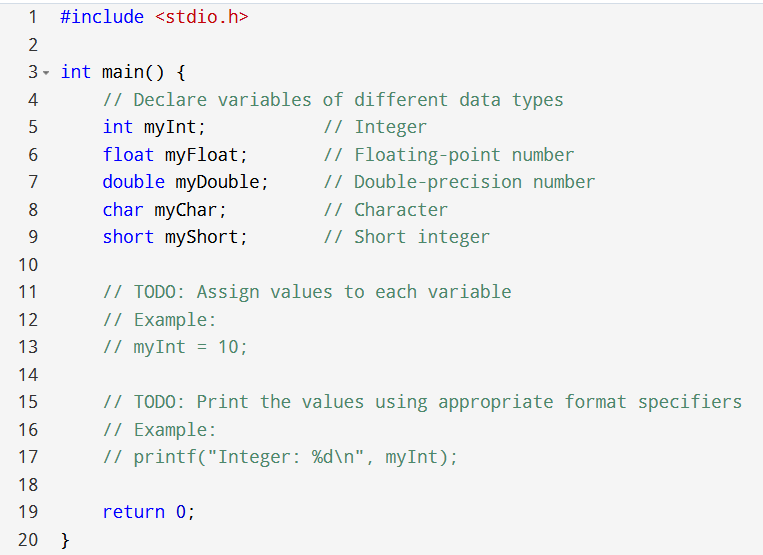
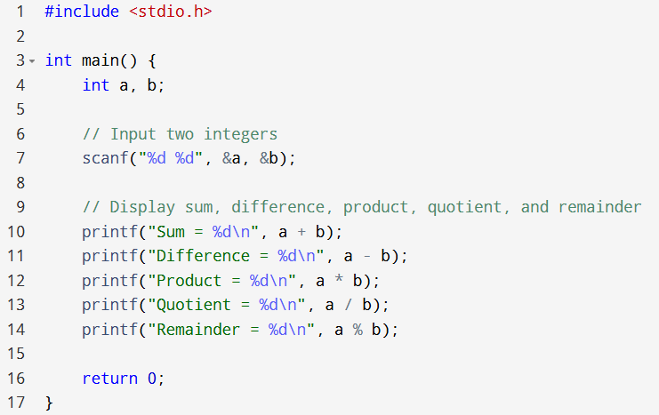
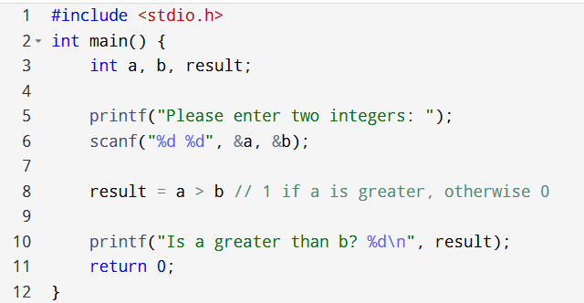
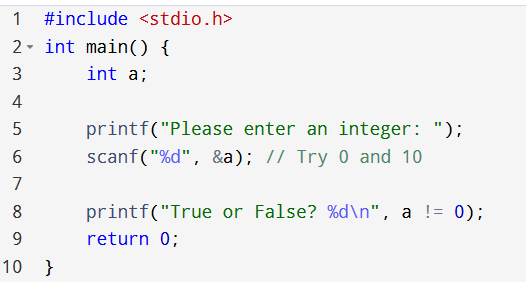
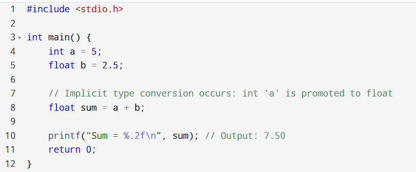
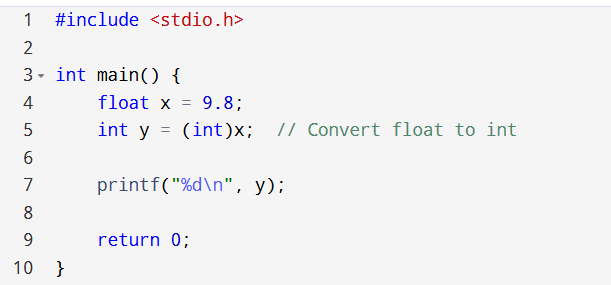
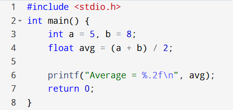

# CSE 1102: Structured Programming Sessional, Lab 02 Week 02

## Lab Title: Variable, Data Types and Expression

## Lab Objectives

- **Declare and use variables and constants** in C using appropriate data types.
- **Perform arithmetic, relational, logical, and bitwise operations** to solve basic computational problems.
- **Understand and apply type conversion and type casting** in mixed-data expressions.
- **Evaluate mathematical and logical expressions** considering operator precedence and associativity rules.
- **Analyze program output and identify errors** related to data types, expressions, and operator usage.

### Course Outcome (CO) and Program Outcome (PO) Mapping

This experiment addresses the following course outcome and its associated program outcome:

- **Course Outcome (CO1):** _Apply basic C syntax to write, compile, and trace simple programs using development tools._
- **Mapped Program Outcome (PO1):** _Apply knowledge of mathematics, natural science, computing, and engineering fundamentals to solve basic engineering problems._
- 
## Lab Tasks

### Variable and Memory

**Variable:** Named memory location that stores values that may change during program execution.

**Initialization:** Always initialize! An uninitialized variable contains "garbage values."

---

### Data types and size (on a 64-bit system)

| Type      | Keyword | Size     | Range / Purpose                          |
|-----------|--------|----------|------------------------------------------|
| Integer   | int    | 4 Bytes  | Whole numbers (-2³¹ to 2³¹−1)             |
| Character | char   | 1 Byte   | Single ASCII characters / small integers |
| Float     | float  | 4 Bytes  | Decimals (6 decimal places precision)    |
| Double    | double | 8 Bytes  | High precision decimals (15 places)      |


### Constants

Store fixed values that cannot be modified.

```c
const int MAX = 100;
#define PI 3.14
````

(Pre-processor macro, replaces text before compiling)


## Problem 1

Write a C program to declare an integer variable to store the radius of a circle and a constant float to store the value of PI (3.1416). Print both values.

### Sample Answer




**Think:**
What will happen if you try to change the values of PI (try `PI = 3.1`) in this program?


## Problem 2

Modify the code above to prompt the user for the radius value and use `#define` to declare the constant PI.

**Hints:**
Use `scanf()`.
May try `scanf("%d", &radius);`


## Problem 3

Complete the following C program to declare variables of all basic data types (`int`, `float`, `double`, `char`) and assign values to them. Print the values of all the variables using appropriate format specifiers.




## The Operator Toolbox

### Arithmetic

`+`, `-`, `*`, `/`, `%`

**The Trap:**
`5 / 2` results in `2` (Integer division).

**The Modulo:**
`5 % 2` results in `1` (The remainder). Only works with `int`.


## Problem 4

Write a program to take two integers as input and display their sum, difference, product, quotient, and remainder.

### Sample Answer




**Dear students, please discuss with your friend**

* what will happen if you enter the value of `b` as `0`?
* what will happen if you declare `a` and `b` as `float` instead of `int`?


## Problem 5

Change the above program to store the result of each operation (sum, difference, product, and quotient).

**Hint:**
> *You may use 4 different variables to store the result. Make sure that you are using appropriate data types.*


## Relational Operators

`==`, `!=`, `>`, `<`, `>=`, `<=`

These return `1` (True) or `0` (False).
**In C, any non-zero value is technically true.**


## Problem 6

Write a program to check whether one number is greater than another.

### Sample Answer




## Problem 7

Write a program to check whether two numbers are equal.


## Problem 8

Consider the following code and discuss with your friend what the value of `result` will be if you enter `0` and `10`.



## Logical Operators

`&&` (AND), `||` (OR), `!` (NOT)

Used to combine multiple conditions:

```c
if (age > 18 && voter == 1)
```

## Problem 9

Write a C program that takes marks of two subjects as input from the user and prints `1` if the student has passed in both subjects (marks greater than 40) or `0` otherwise.

Use the logical AND (`&&`) operator to determine the pass status.

### Sample Answer


## Problem 10

Write a program to check whether a number is within the range `10` to `50`.


## Type Conversion & Casting

### Implicit (Automatic)

C promotes "smaller" types to "larger" ones to avoid data loss.

**Example:**
`int + float → float`

### Explicit (Casting)

You force the conversion.

```c
float result = (float) 5 / 2;  // 2.5
```


## Problem 11

Write a C program that takes an integer and a floating-point number, adds them, and prints the result. Observe what type the result becomes.

### Sample Answer




**Dear students, please note that**

> - *The integer `a` is automatically promoted to the float type when added to `b`.*
> - *The result is a float, preserving the decimal part.*


## Problem 12

Type casting manually converts a variable from one data type to another. Execute the following code and observe the result.




## Problem 13

Write a program to calculate the average of two integers and display the result as a float using casting.

Discuss with your friend to find the error in the following code, which was written to solve the above problem, and fix it.



## Expression Evaluation (Rules of the Road)

When an expression has multiple operators, C follows **Precedence and Associativity**.

* Parentheses: `()` always go first.
* Multiplicative: `*`, `/`, `%` (Left to Right)
* Additive: `+`, `-` (Left to Right)
* Relational: `<`, `>`, `<=`, `>=`
* Logical: `&&` then `||`


## Problem 14

Evaluate the following expression in C and print the result:

```c
int result = 5 + 3 * 2;
```

```c
int x = 10, y = 4, z = 2;
int result = x - y * z + 6 / 2;
```

```c
int a = 5, b = 10, c = 7;
int result = (a < b) && (b > c) || (a == c);
```


## Challenge Problem (try it yourself, do not use the internet)

Write a C program to reverse a two-digit integer entered by the user.

**Example:**
If the input is `32`, the program should display `23`.


# Lab Report Task

## Instructions for Students

* Complete the report individually.
* Include only the tasks listed below.
* Write clearly, and include brief observations.
* Use simple C programs; full programs are not required for every topic.


## 1. Lab Objective (2–3 lines)

Write the objective in your own words.

### Example

To understand variables, constants, data types, arithmetic, relational, logical, and bitwise operations, type conversion, and expression evaluation in C.


## 2. Key Concepts (3–5 bullet points)

List the key concepts covered in this lab.

### Example

* Variables and constants
* Arithmetic, relational, and logical operators
* Bitwise operations
* Type conversion and type casting
* Expression evaluation


## 3. Programs to Include (Choose any 3 representative programs)

For each program:

* Problem statement (1–2 lines)
* Source code (concise version)
* Sample input and output (use only text)
* Brief observation (1–2 lines)

### Example Code

**Problem:**
Declare an integer variable for age and a constant for PI. Print both.

```c
#include <stdio.h>

int main() {
    int age = 20;
    const float PI = 3.14;

    printf("Age = %d\n", age);
    printf("PI = %.2f\n", PI);

    return 0;
}
```

**Input:** None

**Output:**

```
Age = 20
PI = 3.14
```

**Observation:**
Constant PI cannot be modified; age can be changed if needed.


## 4. Conclusion (2–3 lines)

Summarize what you learned in the lab.

### Example

I learned how variables and constants work, how arithmetic, relational, and logical operations are performed in C, and how type casting affects the results of expressions.
