# Course Code: CSE 1102 Structured Programming Sessional

## Lab No: 03 | Week: 03

## Lab Title: Conditional Statements & Selection Control in C

## Objectives

- Understand and apply conditional statements in programming
- Implement logical decision-making using if–else, switch–case, and ternary operators
- Develop problem-solving skills using nested conditional statements and real-life applications

### Course Outcome (CO) and Program Outcome (PO) Mapping

This experiment addresses the following course outcome and its associated program outcome:

- **Course Outcome (CO1):** _Apply basic C syntax to write, compile, and trace simple programs using development tools._
- **Mapped Program Outcome (PO1):** _Apply knowledge of mathematics, natural science, computing, and engineering fundamentals to solve basic engineering problems._

> **Note for students:** This lab assumes you have clear understanding of the following things:
> Basic structure of a C program
> Variables and data types (int)
> Input and output using `printf()` and `scanf()`
> Performing arithmetic, relational, logical, and bitwise operations

## Brief Theory

A conditional statement helps a program make decisions. It checks a Condition (true or false) and then runs code based on that result.
Types of Conditional Statements:

- if Statement
- if-else Statement
- if-else-if Statement
- switch Statement
- Ternary Operator

### `if` syntax:

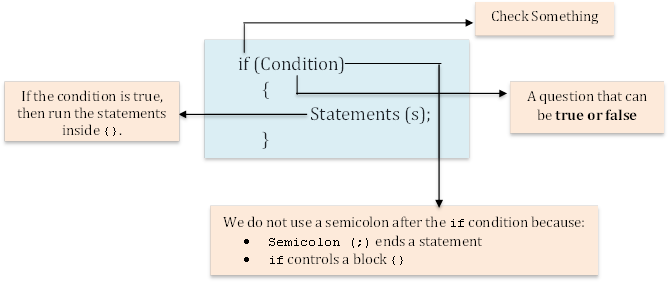

### General Flow of an (if) Statement

Star → Initialization→ Check condition → True: run code → False: skip code → continue program

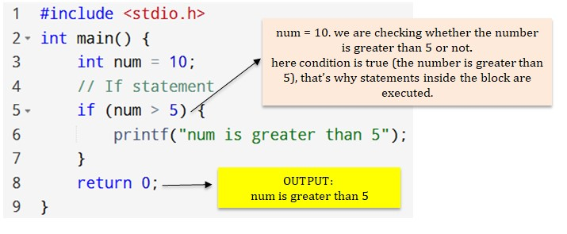

### `if-else` Statement:

`if-else` statement provides an alternative block of code to execute when the condition is false.

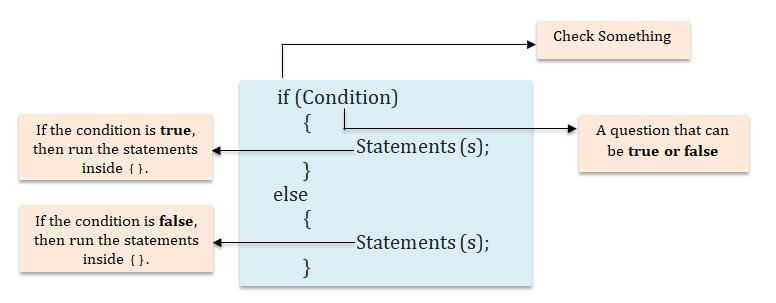

### Lab Task:

### Problem 1: Write a program to check whether a number is negative or not.

**Algorithm:**

1. Start
2. Read number
3. If number < 0
4. Print "Negative number"
5. Else
6. Print "Not a negative number"
7. End

**Program:**
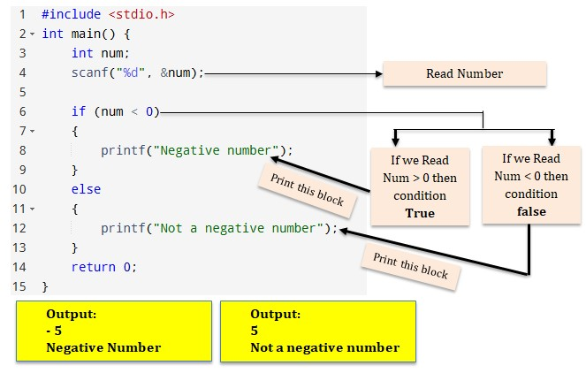

### Problem 2:

Write a program to check if a person is eligible to vote or not.
• A person is eligible to vote if they are 18 years or older.

### Problem 3:

Copy the following code, paste it to your code blocks, and update the code by filling the blanks so that it finds the larger number between two numbers.

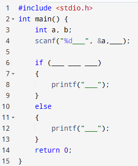

### Problem 4:

Write a C program to check whether a number is even or odd.

**Algorithm:**

1. Start
2. Read number
3. If number mod (%) 2 equals (==) 0 **_[NB:% means Reminder (ভাগশেষ)]_**
4. Print "Even"
5. Else
6. Print "Odd"
7. End

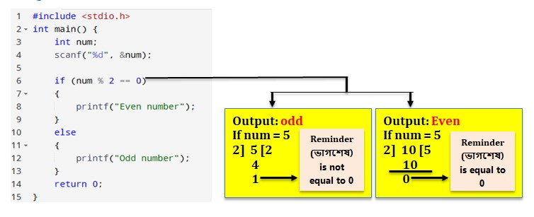

### `if-else if` Statement:

`if-else if` is a conditional statement in programming that allows you to test multiple conditions one by one and execute different code depending on which condition is true.

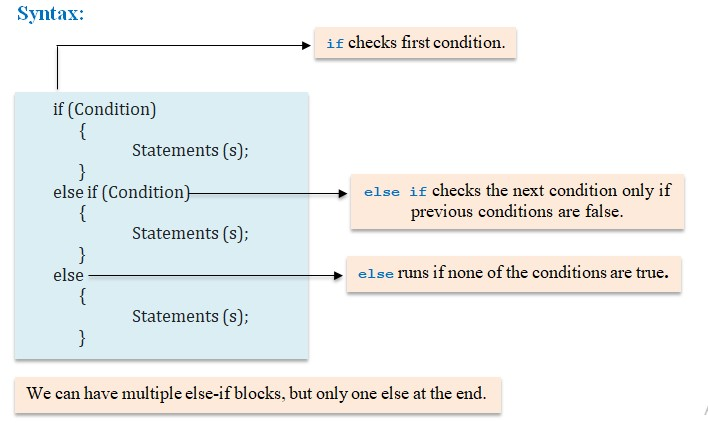

### Problem 5:

Write a program to check whether a year is leap year or not.
**Algorithm:**

1. Start
2. Input year
3. If year divisible by 400 → Leap Year
4. Else if year divisible by 100 → Not Leap Year
5. Else if year divisible by 4 → Leap Year
6. Else → Not Leap Year
7. Stop

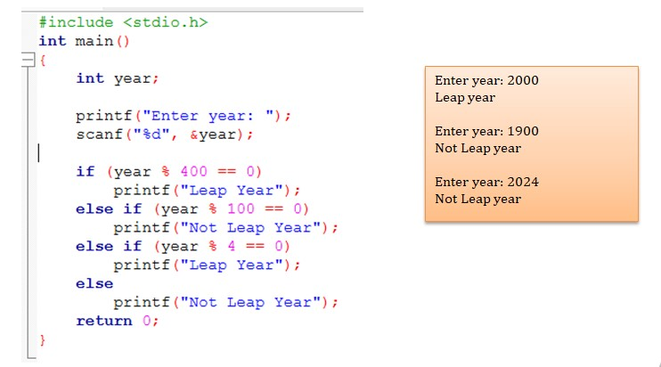

### Problem 6:

Change the above program using logical Operator (&&, | |).

### Problem 7:

Write a C program that takes marks of three subjects as input from a student, calculates the average marks, and determines the final grade based on the average.
The grading system is as follows:
• (average >= 80), print Grade A;
• (Average >= 60 and average <= 79), print Grade B;
• (Average >= 40 and average <= 59), print Grade C;
• (Average < 40), print Grade F;

### Problem 8:

Change the above program including this condition that if any individual subject mark is below 40, the student will be considered Fail regardless of the average.

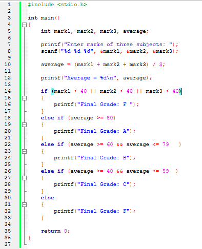

### Problem 9:

Write a C program to check whether a character is an alphabet, digit or special character.
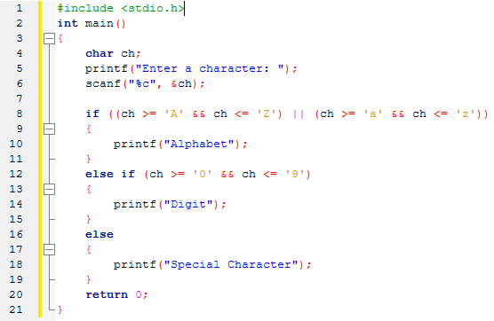

### The `switch` Statement:

A switch statement is used to select one block of code from multiple options based on a single variable value. It is mainly used when we have many conditions for one variable.
**Syntax:**

```c
switch (expression) {
  case x:
    // code block
    break;
  case y:
    // code block
    break;
  default:
    // code block
}
```

### Problem 10:

Write a C program that takes an integer input from the user between 1 and 7 and prints the corresponding day of the week.
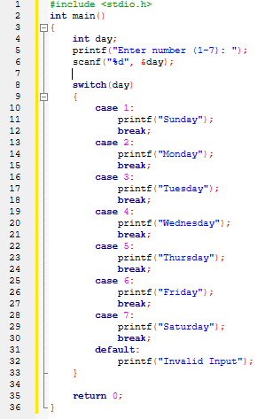

### Problem 11:

Write a C program to create a simple calculator that performs addition, subtraction, multiplication, and division based on user input using switch.

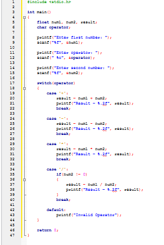

### Ternary Operator:

The ternary operator is a short form of if-else. It is also called Conditional Operator.

**Syntax:**
`condition ? expression_if_true : expression_if_false;`

### Problem 12:

Write a C program to check whether a number is even or odd using ternary operator.
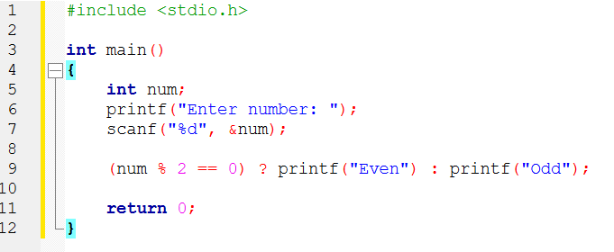

### Problem 13:

Write a program that takes two integers as input from the user and uses the ternary operator to find and print the larger of the two.

**_Choose any three problems from this practice problem list to prepare your lab report. The detailed instructions for preparing the lab report are provided in the Lab 02 manual. Please follow them carefully._**

### Practice Problems:

1. Write a program to check whether a number is divisible by 5.
2. Write a program to check whether a character is an uppercase or lowercase letter.
3. Write a program to check whether a triangle is (given three sides):
   - Equilateral
   - Isosceles
   - Scalene
4. Write a program to check whether three sides can form a valid triangle.
5. Write a program to input a month number (1–12) and print the number of days in that month (ignore leap year).
6. Write a program that takes a number (1–4) and prints:
   - 1 → North
   - 2 → South
   - 3 → East
   - 4 → West
7. Write a program to check whether a person is eligible to vote (age ≥ 18) using ternary operator.
