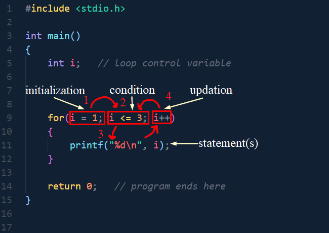
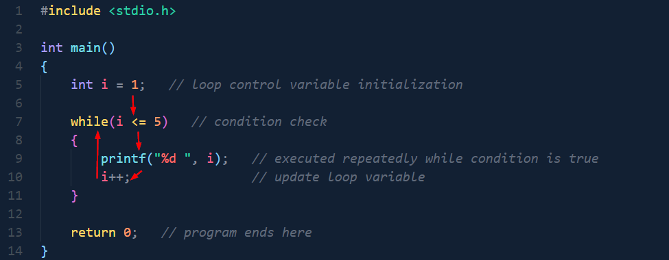

# CSE 1102 Structured Programming Sessional, Week 04

## Experiment: Loops in C

## 1. Objectives of the Lab

The objective of this lab is to enable students to:

* Apply basic C syntax to write, compile, and execute programs using simple loop constructs (`for`, `while`, and `do-while`).
* Understand and trace the execution flow of loops through dry runs and output verification.
* Use loop control statements such as break and continue to control program execution.
* Develop correct programming habits by writing clear, structured, and readable C code following basic coding practices.
 
### Course Outcome (CO) and Program Outcome (PO) Mapping

This experiment addresses the following course outcome and its associated program outcome:

- **Course Outcome (CO1):**  
  Apply basic C syntax to write, compile, and trace simple programs using development tools.
- **Mapped Program Outcome (PO1):**  
  PO1 – Apply knowledge of mathematics, natural science, computing, and engineering fundamentals to solve basic engineering problems.

## 2. Prerequisites

Students should be familiar with:

* Basic structure of a C program
* Variables and data types (`int`)
* Input and output using `printf()` and `scanf()`
* Relational operators (`<`, `<=`, `>`, `==`)
* Conditional statements (`if else` and `switch`)

## 3. Lab Rules

1. Write the algorithm/pseudcode before writing the program.
2. Perform a dry run before executing the program.
3. Write output clearly in the lab report.
4. Move to the next task only after instructor approval.

## 4. Brief Theory

A **loop** allows a block of code to execute repeatedly as long as a condition remains true.

## 5. `for` Loop

### Syntax

```c
for(initialization; condition; updation)
{
    statement(s);
}
```


### General Flow of a for Loop

Start → Initialization → Condition Check → Execute Statement(s) → Update Variable → Condition Check → … → End




### Lab Tasks:

### Example 1: Print Numbers from 1 to 5 (for Loop)

**Algorithm:**

1. Start
2. Set `i = 1`
3. Check if `i <= 5`
4. Print `i`
5. Increase `i` by 1
6. Repeat steps 3–5
7. End

**Program:**

```c
#include <stdio.h>

int main()
{
    int i;   // loop control variable

    for(i = 1; i <= 5; i++)   // initialize i, check condition, update i
    {
        printf("%d ", i);   // executed repeatedly while condition is true
    }

    return 0;   // program ends here
}

```
**Dry Run / Trace Table:**

| Iteration | i (before) | Condition     | Printed | i (after) |
| --------: | ---------- | ------------- | ------- | --------- |
|         1 | 1          | 1 ≤ 5 (True)  | 1       | 2         |
|         2 | 2          | 2 ≤ 5 (True)  | 2       | 3         |
|         3 | 3          | 3 ≤ 5 (True)  | 3       | 4         |
|         4 | 4          | 4 ≤ 5 (True)  | 4       | 5         |
|         5 | 5          | 5 ≤ 5 (True)  | 5       | 6         |
|         6 | 6          | 6 ≤ 5 (False) | —       | Loop ends |


**Output:**

```
1 2 3 4 5
```

#### Task 1: 

Write a C program to print values from 1 to 20 using `for` loop.

#### Task 2: 

Copy the following code, paste it to your codeblocks, and **update the code by filling the blanks** so that it prints **20 to 30**.

```c
#include <stdio.h>

int main()
{
    int i;

    for (i = ___; i __ __ ; i ___)
    {
        printf("%d ", i);
    }

    return 0;
}
```

#### Task 3:
Write a C program to print 10 to 1 using for loop. 
*[hint: use decrement operator in the updation.]*


### Example 2: Find the Sum of Even Numbers from 1 to 10 (for Loop)

**Algorithm:**

1. Start
2. Set `i = 1`
3. Set `sum = 0`
4. Check if `i <= 10`
5. If `i` is even, add `i` to `sum`
6. Increase `i` by 1
7. Repeat steps 4–6
8. Print the value of `sum`
9. End


**Program:**

```c
#include <stdio.h>

int main()
{
    int i;
    int sum = 0;   // stores sum of even numbers

    for(i = 1; i <= 10; i++)
    {
        if(i % 2 == 0)
        {
            sum = sum + i;
        }
    }

    printf("Sum of even numbers = %d", sum);

    return 0;
}
```

**Dry Run / Trace Table:**

| Iteration | i (before) | i % 2 == 0 | sum (before) | sum (after) |
| --------: | ---------- | ---------- | ------------ | ----------- |
|         1 | 1          | False      | 0            | 0           |
|         2 | 2          | True       | 0            | 2           |
|         3 | 3          | False      | 2            | 2           |
|         4 | 4          | True       | 2            | 6           |
|         5 | 5          | False      | 6            | 6           |
|         6 | 6          | True       | 6            | 12          |
|         7 | 7          | False      | 12           | 12          |
|         8 | 8          | True       | 12           | 20          |
|         9 | 9          | False      | 20           | 20          |
|        10 | 10         | True       | 20           | 30          |


**Output:**

```
Sum of even numbers = 30
```


### Task 4:

Write a C program to find the sum of even numbers from 1 to 50 using a `for` loop.

### Task 5:

Write a C program to find the **sum of odd numbers** from 1 to 50 using a `for` loop.


## 6. `while` Loop

### Syntax

```c
initialization;

while(condition)
{
    statement(s);
    updation;
}
```


### General Flow of a while Loop

Start → Initialization → Condition Check → Execute Statement(s) → Update Variable → Condition Check → … → End




*(Note: The flow is similar to the `for` loop, but initialization and updation are written separately.)*


## Lab Tasks:

### Example 3: Print Numbers from 1 to 5 (while Loop)

**Algorithm:**

1. Start
2. Set `i = 1`
3. Check if `i <= 5`
4. Print `i`
5. Increase `i` by 1
6. Repeat steps 3–5
7. End


**Program:**

```c
#include <stdio.h>

int main()
{
    int i = 1;   // loop control variable initialization

    while(i <= 5)   // condition check
    {
        printf("%d ", i);   // executed repeatedly while condition is true
        i++;                // update loop variable
    }

    return 0;   // program ends here
}
```


**Dry Run / Trace Table:**

| Iteration | i (before) | Condition     | Printed | i (after) |
| --------: | ---------- | ------------- | ------- | --------- |
|         1 | 1          | 1 ≤ 5 (True)  | 1       | 2         |
|         2 | 2          | 2 ≤ 5 (True)  | 2       | 3         |
|         3 | 3          | 3 ≤ 5 (True)  | 3       | 4         |
|         4 | 4          | 4 ≤ 5 (True)  | 4       | 5         |
|         5 | 5          | 5 ≤ 5 (True)  | 5       | 6         |
|         6 | 6          | 6 ≤ 5 (False) | —       | Loop ends |


**Output:**

```
1 2 3 4 5
```


#### Task 6:

Write a C program to print values from **1 to 20** using a `while` loop.


#### Task 7:

Copy the following code, paste it into your CodeBlocks, and **update the code by filling the blanks** so that it prints **20 to 30**.

```c
#include <stdio.h>

int main()
{
    int i = ___;

    while(i __ __)
    {
        printf("%d ", i);
        i ___;
    }

    return 0;
}
```


#### Task 8:

Write a C program to print numbers from **10 to 1** using a `while` loop.
*[hint: use decrement operator in the update statement]*


### Example 4: Find the Sum of Even Numbers from 1 to 10 (while Loop)

**Algorithm:**

1. Start
2. Set `i = 1`
3. Set `sum = 0`
4. Check if `i <= 10`
5. If `i` is even, add `i` to `sum`
6. Increase `i` by 1
7. Repeat steps 4–6
8. Print the value of `sum`
9. End


**Program:**

```c
#include <stdio.h>

int main()
{
    int i = 1;
    int sum = 0;   // stores sum of even numbers

    while(i <= 10)
    {
        if(i % 2 == 0)
        {
            sum = sum + i;
        }
        i++;
    }

    printf("Sum of even numbers = %d", sum);

    return 0;
}
```

**Dry Run / Trace Table:**

| Iteration | i (before) | i % 2 == 0 | sum (before) | sum (after) |
| --------: | ---------- | ---------- | ------------ | ----------- |
|         1 | 1          | False      | 0            | 0           |
|         2 | 2          | True       | 0            | 2           |
|         3 | 3          | False      | 2            | 2           |
|         4 | 4          | True       | 2            | 6           |
|         5 | 5          | False      | 6            | 6           |
|         6 | 6          | True       | 6            | 12          |
|         7 | 7          | False      | 12           | 12          |
|         8 | 8          | True       | 12           | 20          |
|         9 | 9          | False      | 20           | 20          |
|        10 | 10         | True       | 20           | 30          |


**Output:**

```
Sum of even numbers = 30
```


#### Task 9:

Write a C program to find the **sum of even numbers from 1 to 50** using a `while` loop.


#### Task 10:

Write a C program to find the **sum of odd numbers from 1 to 50** using a `while` loop.

## 7. `do-while` Loop

### Syntax

```c
initialization;

do
{
    statement(s);
    updation;
}
while(condition);
```

### General Flow of a `do-while` Loop

Start → Initialization → Execute Statement(s) → Update Variable → Condition Check →
If True → Execute Again → … → End


### Example 5: Print Numbers from 1 to 5 (`do-while` Loop)

**Algorithm**

1. Start
2. Set `i = 1`
3. Print `i`
4. Increase `i` by 1
5. Check if `i <= 5`
6. Repeat steps 3–5 while condition is true
7. End


**Program**

```c
#include <stdio.h>

int main()
{
    int i = 1;   // initialization

    do
    {
        printf("%d ", i);   // printed at least once
        i++;                // update
    }
    while(i <= 5);          // condition check

    return 0;
}
```


**Dry Run / Trace Table**

| Iteration | i (before) | Printed | i (after) | Condition Checked |
| --------: | ---------- | ------- | --------- | ----------------- |
|         1 | 1          | 1       | 2         | 2 ≤ 5 (True)      |
|         2 | 2          | 2       | 3         | 3 ≤ 5 (True)      |
|         3 | 3          | 3       | 4         | 4 ≤ 5 (True)      |
|         4 | 4          | 4       | 5         | 5 ≤ 5 (True)      |
|         5 | 5          | 5       | 6         | 6 ≤ 5 (False)     |


**Output**

```
1 2 3 4 5
```


### Example 6: Observe the Output Carefully

```c
#include <stdio.h>

int main()
{
    int i = 10;

    do
    {
        printf("%d ", i);   // executes before condition check
        i++;
    }
    while(i < 5);

    return 0;
}
```

**Output**

```
10
```

*(Explain the output)*


### Task 11

Write a C program using a `do-while` loop to print numbers from **5 to 10**.


## 8. `break` Statement

### Brief Theory

The `break` statement is used to **immediately terminate a loop**.
Once `break` is executed, the loop stops and control moves outside the loop.


### Example 7: Stop the Loop When the Value is 5

```c
#include <stdio.h>

int main()
{
    int i;

    for(i = 1; i <= 10; i++)
    {
        if(i == 5)
        {
            break;          // exits the loop when i becomes 5
        }

        printf("%d ", i);   // prints only before break is executed
    }

    return 0;
}
```


### Output

```
1 2 3 4
```


### Example 8: Stop When the First Even Number is Found

```c
#include <stdio.h>

int main()
{
    int i;

    for(i = 1; i <= 10; i++)
    {
        if(i % 2 == 0)
        {
            break;          // stops loop at first even number
        }

        printf("%d ", i);   // prints only odd numbers before break
    }

    return 0;
}
```


### Output

```
1
```


### Tasks (break)

1. Write a C program to print numbers from **1 to 10** but stop when the number **7** is reached.
2. Write a C program that starts printing from **1** and stops when a number divisible by **4** is found.


## 9. `continue` Statement

### Brief Theory

The `continue` statement is used to **skip the current iteration** of a loop and move directly to the next iteration.

The loop does **not stop**; only the remaining statements in the current iteration are skipped.


### Example 9: Skip Printing the Number 5

```c
#include <stdio.h>

int main()
{
    int i;

    for(i = 1; i <= 10; i++)
    {
        if(i == 5)
        {
            continue;       // skips printing when i is 5
        }

        printf("%d ", i);   // executes for all values except 5
    }

    return 0;
}
```


### Output

```
1 2 3 4 6 7 8 9 10
```


### Example 10: Skip Even Numbers

```c
#include <stdio.h>

int main()
{
    int i;

    for(i = 1; i <= 10; i++)
    {
        if(i % 2 == 0)
        {
            continue;       // skips even numbers
        }

        printf("%d ", i);   // prints only odd numbers
    }

    return 0;
}
```


### Output

```
1 3 5 7 9
```


### Tasks (continue)

1. Write a C program to print numbers from **1 to 20**, skipping numbers divisible by **4**.
2. Write a C program to print numbers from **1 to 15**, skipping numbers divisible by **3**.


## 10. Practice Problems

1. Print numbers from **1 to 30**, skipping multiples of **5**.
2. Print numbers from **1 onward** and stop when the number **9** is printed.
3. Print numbers from **20 to 1**, skipping the number **13**.
4. Print only **odd numbers** between **1 and 40**.
5. Find the sum of numbers from **1 to 100**, but stop adding when the sum exceeds **150**.
