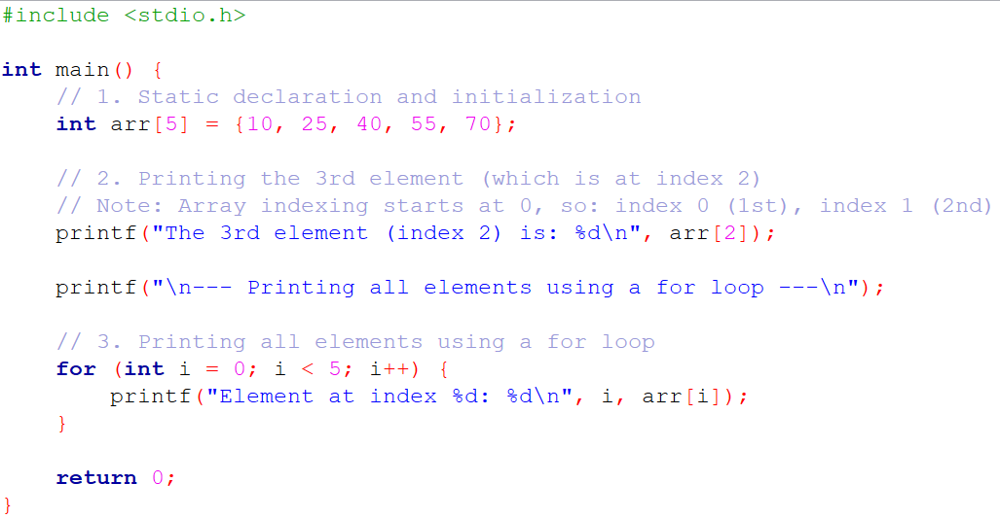
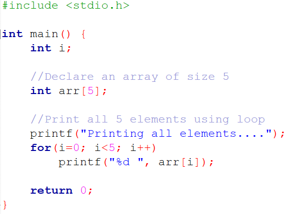
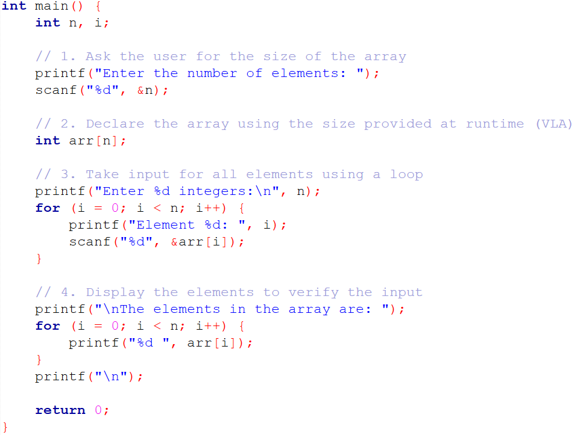
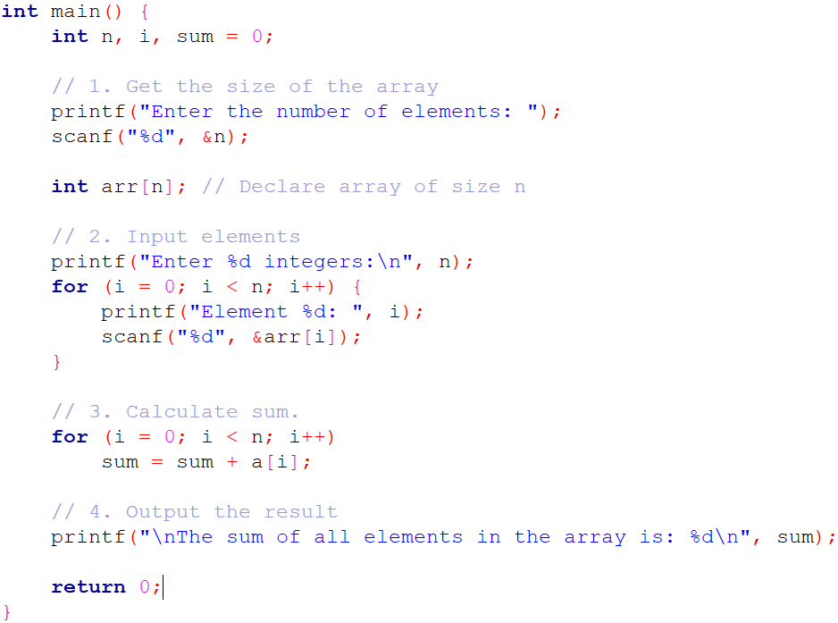
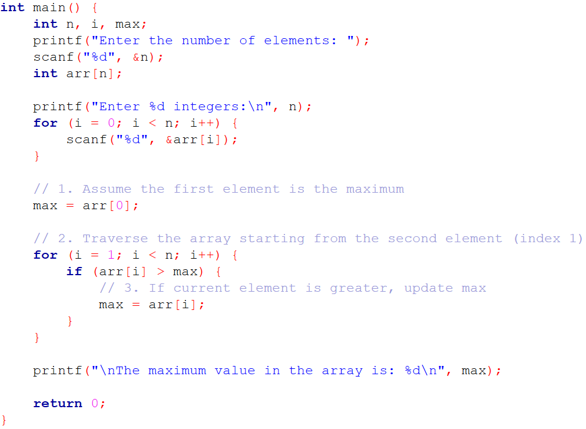
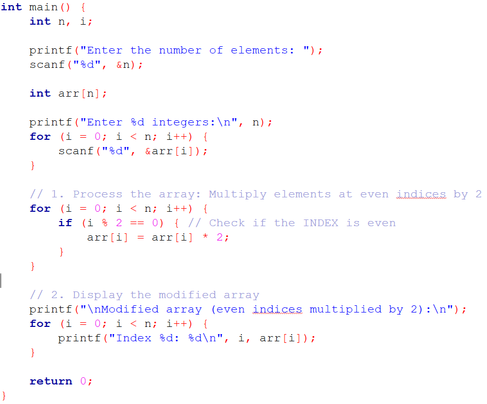
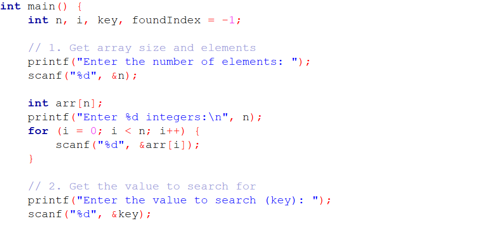
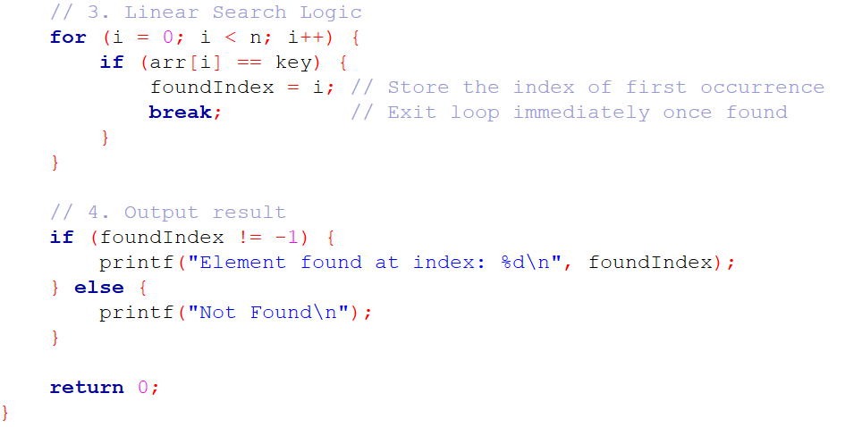

# Structured Programming Language Sessional, Lab 06

## Lab Title: Arrays and String — Part 1

**Week: 06**
**Corresponding CO–PO:**
**CO3:** _Apply arrays, strings, pointers, and dynamic memory to solve structured programming problems in C while following basic debugging and coding practices._

## Lab Objectives

At the end of this lab, students will be able to:

- Declare and initialize one-dimensional arrays in C
- Access and manipulate array elements using indexing
- Explain the memory representation of arrays
- Implement linear search to find an element in an array
- Analyze the time complexity of linear search in best, average, and worst cases

## Lab Problems

### Problem 1

Declare a static integer array of size 5, initialize it with 5 values, print the 3rd element (index 2), and then print all elements using a `for` loop.

#### Sample Answer



### Problem 2

Repeat **Problem 1**, but print all elements using a `while` loop instead of a `for` loop.

### Challenge 1

Try replacing:

```c
int arr[5] = {...};
```

with:

```c
arr[] = {...};
```

without specifying the type.
Discuss why this works or fails.

### Challenge 2

Given:

```c
int arr[] = {12, 25, 37, 40};
```

Write a program to determine the number of elements **without manually counting**.

**Hint:**

```c
sizeof(arr) / sizeof(arr[0])
```

### Problem 3

Find out what will happen if you run the following code.
Discuss the possible reason(s).



### Problem 4

Write a C program that asks the user to enter the size of an integer array at runtime. Declare the array using this size, take input for all elements, and display them.

#### Sample Answer



## Key Concepts

- When you use a **Variable Length Array (VLA)**, the computer waits until the program is running to allocate memory on the stack.
- Unlike a static array (where the size is hard-coded), the compiler does not know the exact memory requirement until runtime.
- While VLAs are common in modern GCC/Clang compilers, they were made **optional in C11**.
- For very large datasets, professional C programmers often use **Dynamic Memory Allocation** (`malloc`).
- **Index Rule:**

  - First element → `arr[0]`
  - Last element → `arr[n-1]`

- Using `n` as the loop limit makes the code flexible for any input size.

### Discussion Points

Find out what happens if you:

- Enter a negative number or a very large number (e.g., 1 billion) as array size
- Try to print the element at index `n`, i.e., `arr[n]`

### Problem 5

Write a C program that takes an integer value `n` from the user and then accepts `n` integer elements into a one-dimensional array. Then calculate and print the **sum** of all elements.

#### Sample Answer



> **Note:**
> The variable `sum` must be initialized to `0`. Otherwise, it will contain a _garbage value_, leading to incorrect results.

### Problem 6

Modify the above program to remove the second loop and calculate the sum **while taking input** in the first loop.

### Problem 7

Calculate and print the **average** of the elements.

### Problem 8

Find and print the **maximum value** in the array.

#### Sample Answer



> Discuss why initializing the first element as the maximum is important.

### Problem 9

Find and print the **minimum value** in the array.

### Problem 10

Multiply every element stored at an **even index** (0, 2, 4, …) by 2 and print the modified elements.

#### Sample Answer



---

### Problem 11

Write a C program that takes an integer `n`, reads `n` integers into an array, and searches for a given value `key` using **linear search**.

- If the key is found, print the index of its **first occurrence**
- Otherwise, print **“Not Found”**

#### Sample Answer




### Problem 12

Modify the above program to:

- Count and display the number of comparisons performed during the search
- State the **time complexity** of linear search

Discuss the **best-case** and **worst-case** complexity with your friends.

### Challenge 3

Use an array to store the first `n` **Fibonacci numbers**.

**Hint:**

```c
arr[0] = 0;
arr[1] = 1;
arr[i] = arr[i-1] + arr[i-2];
```
